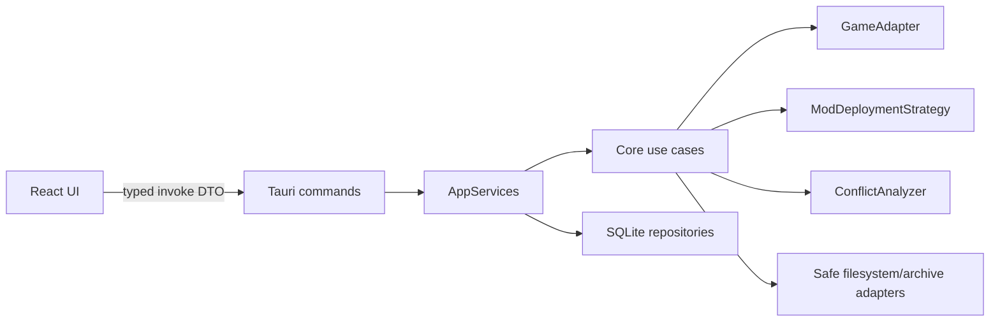
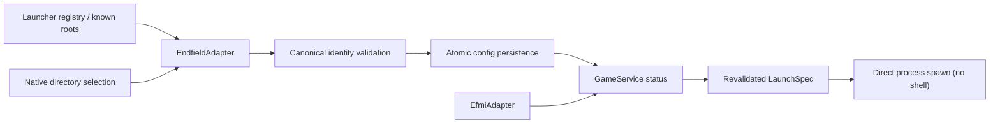
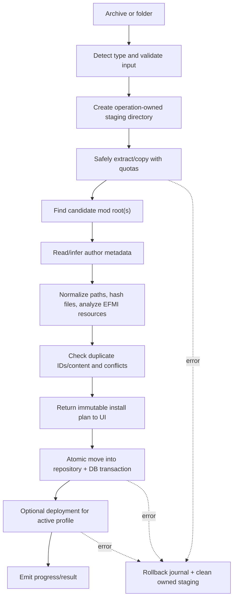

# AEMM Architecture

## Design principles

- Ports and adapters: domain/core modules define behavior; Tauri, SQLite, filesystem, and EFMI are adapters.
- Explicit ownership: AEMM only mutates its repository, staging roots, and validated deployment roots.
- Transactional workflows: operations build a plan first and record enough state to undo partial work.
- Async boundaries: Tauri commands are async; blocking archive/filesystem work runs in bounded blocking tasks; database access uses an async SQLite pool.
- Evolution over speculation: interfaces reserve known variation points, while online services and dependency resolution wait until their phases.

## Runtime flow



The webview never receives unrestricted filesystem primitives. Commands expose narrow application use cases.

## Repository layout

```text
/
├─ src/                         React application
│  ├─ app/                     app composition, router, providers
│  ├─ components/              reusable UI components
│  ├─ features/                feature UI and frontend data access
│  │  ├─ dashboard/
│  │  ├─ mods/
│  │  ├─ profiles/
│  │  └─ settings/
│  ├─ lib/                     invoke client and shared helpers
│  ├─ pages/                   route-level composition
│  ├─ styles/                  design tokens and global styles
│  └─ types/                   frontend DTO types
├─ src-tauri/
│  ├─ migrations/              ordered SQLite migrations
│  └─ src/
│     ├─ commands/             thin Tauri transport adapters
│     ├─ core/
│     │  ├─ game/              game adapter contract and validation
│     │  ├─ mods/              scanning, installation, metadata
│     │  ├─ profiles/          profile application/use cases
│     │  ├─ deployment/        deployment plans and strategies
│     │  └─ conflicts/         analyzer contracts and conflict graph
│     ├─ database/             pool, migrations, repositories
│     ├─ errors/               domain and public command errors
│     ├─ models/               domain entities and command DTOs
│     ├─ services/             application orchestration/state
│     ├─ utils/                path safety and other cross-cutting helpers
│     ├─ lib.rs                Tauri application composition
│     └─ main.rs               minimal executable entry point
└─ project memory documents
```

## Backend module responsibilities

### Game management

`GameAdapter` encapsulates edition-specific behavior:

- discover installation candidates from known roots, manifests, and registry entries;
- validate an installation with evidence and a confidence score;
- read version/build information;
- resolve game executable and loader/deployment roots;
- construct (but not blindly execute) a safe launch specification.

An `EfmiGameAdapter` can wrap an Endfield adapter with loader-specific validation and launch behavior. CN/global variants become separate adapter configurations or implementations.

Phase 2 implements this boundary as three layers:

- `EndfieldAdapter`: discovers candidates and validates product identity. It does not know UI state or mutate settings.
- `EfmiAdapter`: validates loader structure and `d3dx.ini`, with `valid` separated from `launch_ready` so a stale launch path cannot be executed accidentally.
- `GameService`: coordinates settings, adapters, launch modes, and process spawning. It exposes only validated roots/specifications to Tauri commands.



The current identity rule requires a canonical directory containing direct-child `Endfield.exe`, `UnityPlayer.dll`, and `GameAssembly.dll`, plus `Endfield_Data/app.info` with the exact `Hypergryph` / `Endfield` identity. The adapter intentionally reports an unknown game version until an authoritative version source is confirmed.

### Mod management

- `RepositoryRoot` / `RepositoryRelativePath`: prove repository ownership and provide canonical, contained filesystem boundaries before scanning.
- `ModScanner`: scans owned repository entries on a blocking worker and produces normalized candidates, file inventories, BLAKE3 identities, issues, and incremental-cache metrics.
- `ModMetadataManager`: reads author `mod.json` and infers missing metadata. The SQLite adapter stores local overrides separately and applies them only in query DTOs.
- `ModInstaller`: coordinates staged, rollback-capable installation plans.
- `ModManager`: query and lifecycle orchestration.
- `ModConflictDetector`: consumes normalized deployed artifacts and specialized analyzers.

Phase 3 implements the scanner path as follows:

```mermaid
flowchart LR
  Settings["Configured repository"] --> Ownership["RepositoryRoot ownership + canonical validation"]
  Ownership --> Cache["Load size/mtime/hash cache from SQLite"]
  Cache --> Worker["Blocking filesystem inventory + BLAKE3"]
  Worker --> Metadata["Read mod.json or infer metadata"]
  Metadata --> Snapshot["Immutable RepositoryScan snapshot"]
  Snapshot --> Transaction["Transactional ModStore synchronization"]
  Transaction --> DTO["List/scan DTOs for Tauri commands"]
```



Only direct child directories are repository mods. The scanner never executes content and never derives deployment destinations. Top-level files, links, junctions, reparse points, non-regular files, and unsafe relative names are skipped or reported. Duplicate case-insensitive logical IDs reject the snapshot before database mutation.

### Deployment

`ModDeploymentStrategy` is a port with `plan_deploy`, `deploy`, `plan_revoke`, `revoke`, and `verify` semantics. Planned implementations include copy, move, symbolic link/junction, hard link, configuration editing, and EFMI-native deployment.

Every deployment records a manifest of created paths, source content identity, strategy, and previous state. Revoke only removes paths recorded by that manifest and revalidates containment before each destructive action.

### Profiles

Profiles store enabled mod IDs and stable load-order positions. Switching profiles computes a reconciliation plan:

1. snapshot current state;
2. validate the target profile and all referenced mods;
3. detect conflicts and missing content;
4. revoke no-longer-enabled deployments;
5. deploy newly enabled content in planned order;
6. update profile state in one database transaction;
7. roll back filesystem operations if reconciliation fails.

## Core data model

### Domain entities

- `GameInstallation`: adapter ID, edition, install root, executable, loader root, detected version, validation evidence.
- `AuthorModMetadata`: logical mod ID, name, author, semantic version string, description, category, compatible game version, website, preview relative path, and original document.
- `LocalModMetadata`: display-name/category/description overrides, favorite flag, notes, and tags.
- `InstalledMod`: AEMM UUID, logical ID, repository relative path, content fingerprint, size, install/update timestamps, and lifecycle state.
- `ModFile`: normalized relative source path, optional deployment-relative target, size, content hash, modification timestamp, and descriptive file role.
- `Profile`: UUID, name, timestamps, and ordered `ProfileMod` entries.
- `DeploymentManifest`: strategy ID, owned destination root, created entries, source fingerprints, and timestamps.
- `Conflict`: kind, severity, participating mods, target/resource key, current winner/order, and analyzer evidence.

### SQLite tables

Initial migrations establish:

- `mods`
- `mod_author_metadata`
- `mod_local_metadata`
- `mod_files`
- `profiles`
- `profile_mods`
- `deployment_records`

Schema migrations are embedded and applied at startup. SQLite foreign keys and WAL mode are enabled. Machine-specific settings remain in `config.json`.

Migration `0002_mod_scanning.sql` adds file modification timestamps for incremental Hash reuse, local metadata tags, and lookup/uniqueness indexes. `ModStore::synchronize` uses one transaction: it preserves stable AEMM UUIDs and local overrides, updates author/file snapshots, and marks vanished repository entries broken instead of deleting user data.

## Installation workflow



Archive adapters must reject absolute/UNC/device paths, `..` traversal, unsafe links, case-insensitive collisions, reserved Windows names, excessive entry counts, suspicious compression ratios, and total extracted size above policy limits.

## Enable and disable workflow

Enable computes a deployment plan from a repository snapshot and target adapter, detects conflicts, executes through the chosen strategy, verifies output, persists a deployment manifest and profile state, then signals loader refresh if the adapter supports it.

Disable resolves the recorded manifest, validates that every destination is still inside the approved deployment root and still owned by that manifest, revokes only those entries, preserves repository content, and updates profile state. It never deletes the installed mod itself.

For EFMI, likely Phase 6 options are deploying a repository mod directory into `<EFMI>/Mods` or using EFMI's `DISABLED*` convention. The repository/deployment split remains authoritative so author files are preserved.

## Conflict model

The detector aggregates multiple analyzers:

- path analyzer: same normalized deployment target;
- EFMI/3DMigoto analyzer: duplicate or overlapping INI namespace, override hash, resource, and command-list keys;
- future dependency/version analyzer.

Conflicts reference ordered profile entries so the UI can show the current priority/winner only when the underlying loader provides deterministic ordering.

## Error and logging model

Domain errors are typed with `thiserror`; command adapters convert them to stable `CommandError { code, message, details? }` DTOs. Internal chains are written through `tracing`, while the UI receives actionable, non-sensitive messages.

Logging uses daily rolling files plus debug console output. The non-blocking writer guard lives for the whole application lifetime.

## Security boundaries

- Paths stored in the database are relative whenever possible.
- User-selected roots are canonicalized and typed (`RepositoryRoot`, `DeploymentRoot`, `StagingRoot`) before use.
- Custom repositories must be empty before AEMM creates its ownership marker, or must already contain a valid marker. AEMM refuses to adopt arbitrary non-empty directories.
- All removal APIs require an owned root and a child path; roots and arbitrary absolute paths cannot be removed.
- Installer commits prefer same-volume atomic renames; cross-volume copy uses a journal and verification.
- Tauri capabilities and CSP remain least-privilege.
- Frontend directory selection has only `dialog:allow-open`; selected paths are still treated as untrusted and must pass backend adapter validation before persistence or use.
- Open-directory and launch commands never accept arbitrary executable paths. They resolve saved settings through `GameService`, canonicalize again immediately before use, and launch without a command shell.
