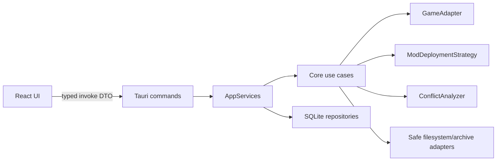
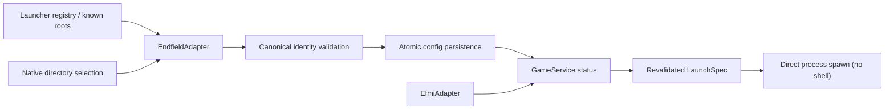
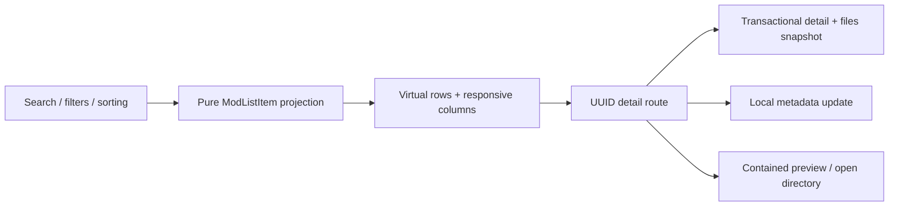
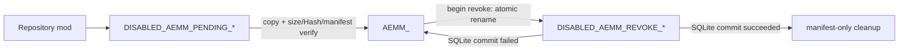
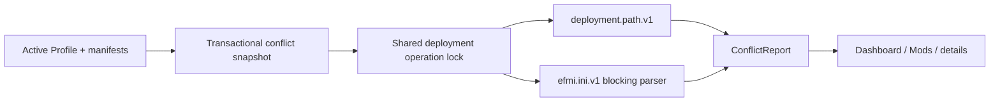
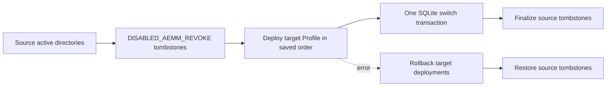
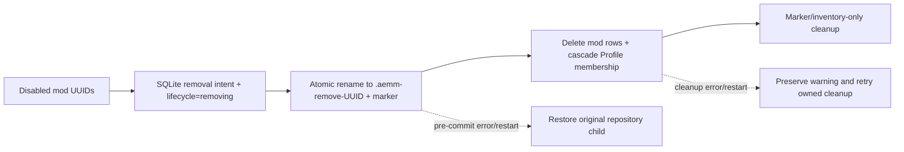
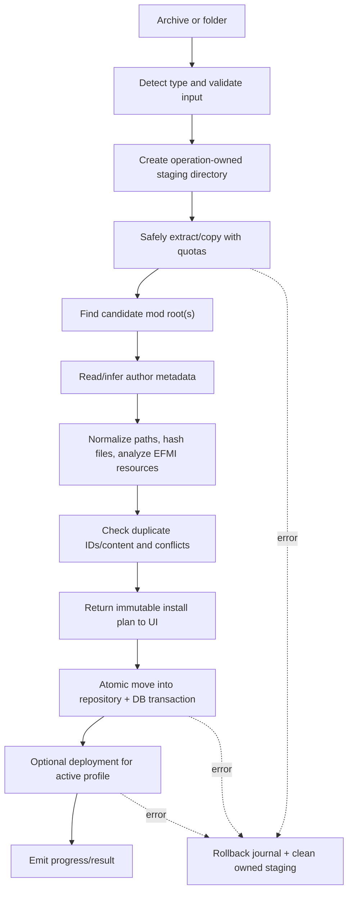

# AEMM Architecture

## Design principles

- Ports and adapters: domain/core modules define behavior; Tauri, SQLite, filesystem, and EFMI are adapters.
- Explicit ownership: AEMM only mutates its repository, staging roots, and validated deployment roots.
- Transactional workflows: operations build a plan first and record enough state to undo partial work.
- Async boundaries: Tauri commands are async; blocking archive/filesystem work runs in bounded blocking tasks; database access uses an async SQLite pool.
- Evolution over speculation: interfaces reserve known variation points, while online services and dependency resolution wait until their phases.

## Runtime flow



The webview never receives unrestricted filesystem primitives. Commands expose narrow application use cases.

## Repository layout

```text
/
├─ src/                         React application
│  ├─ app/                     app composition, router, providers
│  ├─ components/              reusable UI components
│  ├─ features/                feature UI and frontend data access
│  │  ├─ dashboard/
│  │  ├─ mods/
│  │  ├─ profiles/
│  │  └─ settings/
│  ├─ lib/                     invoke client and shared helpers
│  ├─ pages/                   route-level composition
│  ├─ styles/                  design tokens and global styles
│  └─ types/                   frontend DTO types
├─ src-tauri/
│  ├─ migrations/              ordered SQLite migrations
│  └─ src/
│     ├─ commands/             thin Tauri transport adapters
│     ├─ core/
│     │  ├─ game/              game adapter contract and validation
│     │  ├─ mods/              scanning, installation, metadata
│     │  ├─ profiles/          profile application/use cases
│     │  ├─ deployment/        deployment plans and strategies
│     │  └─ conflicts/         analyzer contracts and conflict graph
│     ├─ database/             pool, migrations, repositories
│     ├─ errors/               domain and public command errors
│     ├─ models/               domain entities and command DTOs
│     ├─ services/             application orchestration/state
│     ├─ utils/                path safety and other cross-cutting helpers
│     ├─ lib.rs                Tauri application composition
│     └─ main.rs               minimal executable entry point
└─ project memory documents
```

## Backend module responsibilities

### Game management

`GameAdapter` encapsulates edition-specific behavior:

- discover installation candidates from known roots, manifests, and registry entries;
- validate an installation with evidence and a confidence score;
- read version/build information;
- resolve game executable and loader/deployment roots;
- construct (but not blindly execute) a safe launch specification.

An `EfmiGameAdapter` can wrap an Endfield adapter with loader-specific validation and launch behavior. CN/global variants become separate adapter configurations or implementations.

Phase 2 implements this boundary as three layers:

- `EndfieldAdapter`: discovers candidates and validates product identity. It does not know UI state or mutate settings.
- `EfmiAdapter`: validates loader structure and `d3dx.ini`, with `valid` separated from `launch_ready` so a stale launch path cannot be executed accidentally.
- `GameService`: coordinates settings, adapters, launch modes, and process spawning. It exposes only validated roots/specifications to Tauri commands.



The current identity rule requires a canonical directory containing direct-child `Endfield.exe`, `UnityPlayer.dll`, and `GameAssembly.dll`, plus `Endfield_Data/app.info` with the exact `Hypergryph` / `Endfield` identity. The adapter intentionally reports an unknown game version until an authoritative version source is confirmed.

### Mod management

- `RepositoryRoot` / `RepositoryRelativePath`: prove repository ownership and provide canonical, contained filesystem boundaries before scanning.
- `ModScanner`: scans owned repository entries on a blocking worker and produces normalized candidates, file inventories, BLAKE3 identities, issues, and incremental-cache metrics.
- `ModMetadataManager`: reads author `mod.json` and infers missing metadata. The SQLite adapter stores local overrides separately and applies them only in query DTOs.
- `ModInstaller`: coordinates staged, rollback-capable installation plans.
- `ModManager`: query and lifecycle orchestration.
- `ModConflictDetector`: consumes normalized deployed artifacts and specialized analyzers.

Phase 3 implements the scanner path as follows:

```mermaid
flowchart LR
  Settings["Configured repository"] --> Ownership["RepositoryRoot ownership + canonical validation"]
  Ownership --> Cache["Load size/mtime/hash cache from SQLite"]
  Cache --> Worker["Blocking filesystem inventory + BLAKE3"]
  Worker --> Metadata["Read mod.json or infer metadata"]
  Metadata --> Snapshot["Immutable RepositoryScan snapshot"]
  Snapshot --> Transaction["Transactional ModStore synchronization"]
  Transaction --> DTO["List/scan DTOs for Tauri commands"]
```



Only direct child directories are repository mods. The scanner never executes content and never derives deployment destinations. Top-level files, links, junctions, reparse points, non-regular files, and unsafe relative names are skipped or reported. Duplicate case-insensitive logical IDs reject the snapshot before database mutation.

Phase 5 implements the installer boundary with four focused adapters:

- `StagingRoot` / `StagingOperation`: validate AEMM ownership markers, allocate UUID operation children, atomically persist journals, and delete only fully revalidated owned trees.
- archive adapters: detect ZIP/7z/RAR from signatures, preflight every entry and quota, and write only validated relative paths into an empty operation payload.
- root detector: locate one unique author manifest or unwrap simple packaging directories, while rejecting ambiguous multi-mod bundles instead of guessing.
- `SafeModInstaller`: produce an immutable `ModImportPlan`, rescan before commit, move/copy into the owned repository, expose a commit receipt to the service, and recover or roll back from the journal.

`ModService` is the transaction coordinator: it supplies current database identities to the core installer, serializes commit with repository scans, synchronizes SQLite, marks the journal database-synced, and only then removes staging. Tauri commands accept a source path only for the initial untrusted prepare call; commit/cancel accept only an operation UUID.

Phase 10 adds an independent uninstall transaction. `ModStore::prepare_removals` rejects active enabled mods, records the original/tombstone paths and prior lifecycle, and marks each row `removing` in one transaction. `RepositoryRoot` then atomically quarantines existing direct-child mod roots under marker-owned `.aemm-remove-<UUID>` names. The final database commit deletes the mod rows (cascading Profile memberships) only after quarantine succeeds. Cleanup enumerates and validates the marker inventory rather than calling recursive delete on a mutable directory. Startup recovery restores a tombstone when its mod row still exists, or finishes cleanup after the database row was committed away.

Repository/staging path configuration is also a dedicated `ModService` workflow sharing deployment, installation, and scan locks. The old repository must have zero database records and no content beyond its ownership marker; staging must have no pending operations. New custom roots must be empty or already owned and cannot overlap. The workflow persists canonical paths but deliberately does not move or delete old roots.

### Mods frontend and detail queries

Phase 4 keeps server and UI responsibilities separate:

- `ModStore` returns compact list projections and consistent detail/file snapshots from SQLite transactions.
- `ModService` validates local metadata, caps batch mutations, resolves UUID-backed repository paths, and validates preview signatures.
- Tauri commands only translate typed requests/results and invoke the native opener after the service returns a canonical mod directory.
- TanStack Query owns remote state and cache synchronization; pure query helpers own search/filter/sort behavior.
- TanStack Virtual bounds card/list/file DOM to the visible viewport plus overscan. Card grids virtualize rows so responsive column changes do not require rendering the whole repository.



The browser-preview adapter supplies deterministic fixtures only when Tauri is absent. It exercises UI behavior but cannot mutate desktop files. Desktop commands never accept a repository or preview path from the webview.

### Deployment

`ModDeploymentStrategy` is a port with `plan_deploy`, `deploy`, `plan_revoke`, `revoke`, and `verify` semantics. Planned implementations include copy, move, symbolic link/junction, hard link, configuration editing, and EFMI-native deployment.

Every deployment records a manifest of created paths, source content identity, strategy, and previous state. Revoke only removes paths recorded by that manifest and revalidates containment before each destructive action.

Phase 6 adds `EfmiCopyDeploymentStrategy` (`efmi.copy.v1`) without changing the repository boundary. The adapter accepts only a revalidated EFMI root whose `d3dx.ini` proves recursive `Mods` loading and the `DISABLED*` exclusion convention. It then uses the loader convention as a filesystem transaction primitive:



All destination files are created without overwrite. Active deployment and revoke directories carry `.aemm-deployment.json`, containing the deployment/profile/mod IDs, source fingerprint, destination root and directory, and every relative file's size/BLAKE3 hash. Verify/revoke requires the database JSON, marker JSON, current root, and exact live inventory to agree. Cleanup removes only paths named by the manifest and then empty expected parents; it never recursively deletes a mutable directory snapshot.

`DeploymentService` owns the batch transaction and operation lock. It rolls back already-copied mods when any later batch member fails, persists deployment records and active Profile flags together, rolls back filesystem state when SQLite fails, and defers only marker-verified disabled cleanup to startup recovery. Migration `0003_deployment_state.sql` stores the active Profile reference and adds deployment/profile indexes.

### Conflict analysis

Phase 7 replaces the original placeholder with two analyzer plugins behind `ConflictAnalyzer`:

- `deployment.path.v1` groups only identical actual deployment targets (destination root + deployment directory + relative path), using Windows case-insensitive keys;
- `efmi.ini.v1` parses deployed INIs and groups explicit namespace collisions plus overlapping `TextureOverride` and `ShaderOverride` Hashes. Evidence retains the INI path, section, match/handling values, and directly referenced resource filenames.

`ConflictStore` opens a transaction to snapshot the active Profile, enabled membership order, display names, and matching deployment records. Missing or mismatched manifests are data-integrity errors instead of silently reducing coverage. `ConflictService` and `DeploymentService` share one async operation lock, so analysis observes either the state before or after a deployment transaction, never an intermediate rename/database state.



The INI reader validates each manifest-relative path, canonical containment, and every link/reparse component before opening it. It reads at most 4 MiB per file, 256 INIs per mod, and 64 MiB per report. Common sections emitted by every official EFMI Tools mod (`Constants`, `Present`, `ResourceModName`, and similar) are deliberately not conflicts; explicit namespaces and runtime match Hashes are cross-mod keys.

`ConflictParticipant.load_order` is the stored AEMM Profile position. Phase 7 does not set `winning_mod_id`, because EFMI recursive include order and same-Hash runtime precedence remain unverified. This distinction is part of the DTO and UI, not a presentation-only disclaimer.

### Profiles

Profiles store enabled mod IDs and stable load-order positions. Switching profiles computes a reconciliation plan:

1. snapshot current state;
2. validate the target profile and all referenced mods;
3. require every source enabled row to have an identical deployment manifest and every target mod to remain installed with a content fingerprint;
4. marker-verify and atomically rename all source deployments to EFMI-excluded revoke tombstones;
5. deploy the complete target set in stored order, verifying repository fingerprints and destination inventories;
6. atomically replace source deployment records with target records and update `app_state.active_profile_id` without changing either Profile's desired memberships;
7. finalize source tombstones after commit, or remove target deployments and restore source tombstones if any pre-commit step fails.

The complete-set transition is intentional for `efmi.copy.v1`: active directory names are stable per mod (`AEMM_<mod UUID>`) and the ownership marker includes the Profile ID. Transferring a shared directory in place would require a separate crash-safe marker/database protocol. The current flow favors a verifiable rollback boundary over that optimization.



`ProfileService`, `DeploymentService`, and `ConflictService` share the deployment operation lock. `ProfileStore` additionally checks active IDs, desired memberships, and manifest equality inside its own transactions. Empty-to-empty switches can commit without a loader; any filesystem reconciliation requires a freshly validated EFMI root resolved by `GameService`.

### Application experience and preferences

`ExperienceController` is the presentation-side boundary for persisted locale/theme behavior. It applies the saved language, resolves the system color scheme without touching business state, and keeps the document language synchronized for assistive technology and locale-aware formatting. `GlobalActivityIndicator` observes TanStack Query activity after a short delay so long operations are visible without flashing for cached reads.

The onboarding dialog writes only `onboarding_completed`. Theme, language, log level, and onboarding state share the validated settings DTO, but `AppServices::update_settings` refuses changes to the `game` and `storage` sections. Those path-bearing values remain reachable only through dedicated game/repository workflows with canonical validation.

Feature routes are lazy-loaded at the router boundary. Shared shell/bootstrap code stays in the initial chunk, while Dashboard, Mods, details, Profiles, and Settings are loaded on demand.

Profile order editing uses dnd-kit sensors in the webview and submits an ordered UUID list. `ProfileStore::reorder_enabled` treats that list as an exact permutation of current enabled membership, rejects missing/duplicate/foreign IDs, preserves disabled membership, and rewrites unique load-order positions in one SQLite transaction.

## Core data model

### Domain entities

- `GameInstallation`: adapter ID, edition, install root, executable, loader root, detected version, validation evidence.
- `AuthorModMetadata`: logical mod ID, name, author, semantic version string, description, category, compatible game version, website, preview relative path, and original document.
- `LocalModMetadata`: display-name/category/description overrides, favorite flag, notes, and tags.
- `InstalledMod`: AEMM UUID, logical ID, repository relative path, content fingerprint, size, install/update timestamps, and lifecycle state.
- `ModFile`: normalized relative source path, optional deployment-relative target, size, content hash, modification timestamp, and descriptive file role.
- `Profile`: UUID, name, timestamps, and ordered `ProfileMod` entries.
- `DeploymentManifest`: strategy ID, owned destination root, created entries, source fingerprints, and timestamps.
- `ConflictReport`: active Profile, analyzed/affected counts, analyzer warnings, loader-order verification state, and ordered `Conflict` groups.
- `Conflict`: stable analyzer-derived ID, kind, severity, target/resource key, summary, optional verified winner, and participants with source-path/section/detail evidence.

### SQLite tables

Initial migrations establish:

- `mods`
- `mod_author_metadata`
- `mod_local_metadata`
- `mod_files`
- `profiles`
- `profile_mods`
- `deployment_records`
- `app_state`
- `pending_mod_removals`

Schema migrations are embedded and applied at startup. SQLite foreign keys and WAL mode are enabled. Machine-specific settings remain in `config.json`.

Migration `0002_mod_scanning.sql` adds file modification timestamps for incremental Hash reuse, local metadata tags, and lookup/uniqueness indexes. `ModStore::synchronize` uses one transaction: it preserves stable AEMM UUIDs and local overrides, updates author/file snapshots, and marks vanished repository entries broken instead of deleting user data.

Migration `0003_deployment_state.sql` adds the authoritative active Profile pointer and deployment/profile indexes. Migration `0004_mod_removal_state.sql` records recoverable uninstall intent. On every startup, migrations are followed by bounded SQLite `quick_check(1)` and `foreign_key_check`; corruption is surfaced before services perform filesystem reconciliation.

## Uninstall workflow



An enabled mod must be disabled first so deployment ownership is reconciled independently. Missing repository content can still remove a broken database record, but AEMM never uses the database alone as authority to delete an arbitrary path. A tombstone must be a direct child, non-link/reparse directory whose identity marker and expected UUID/path agree.

## Installation workflow



Archive adapters must reject absolute/UNC/device paths, `..` traversal, unsafe links, case-insensitive collisions, reserved Windows names, excessive entry counts, suspicious compression ratios, and total extracted size above policy limits.

The concrete Phase 5 limits are 20,000 entries, 512 MiB per file, 2 GiB total output, 1,000:1 expansion, 1,024 UTF-8 bytes per stored path, and 64 path components. Limits are centralized in `ExtractionPolicy` for future settings/adapter tuning.

Same-volume commit uses an atomic directory rename. Cross-volume commit copies to a unique `.aemm-install-<operation>.partial` direct child with `create_new`, rescans the copy to verify its BLAKE3 content fingerprint, then renames it to the final destination. The database is synchronized only after the filesystem commit. Any failure verifies the created destination fingerprint before moving it back or deleting it. Startup recovery cross-checks the journal against SQLite so a database-committed mod is preserved while an uncommitted destination is rolled back.

## Enable and disable workflow

Enable computes a deployment plan from a repository snapshot and target adapter, detects conflicts, executes through the chosen strategy, verifies output, persists a deployment manifest and profile state, then signals loader refresh if the adapter supports it.

Disable resolves the recorded manifest, validates that every destination is still inside the approved deployment root and still owned by that manifest, revokes only those entries, preserves repository content, and updates profile state. It never deletes the installed mod itself.

For EFMI, Phase 6 deploys each repository mod to a marker-owned `AEMM_<UUID>` child under `<EFMI>/Mods`, using verified `DISABLED*` names for pending/revoke states. The repository/deployment split remains authoritative so author files are preserved.

## Conflict model

The detector aggregates versioned analyzers:

- path analyzer: same normalized actual deployment target;
- EFMI/3DMigoto analyzer: explicit namespace and override-Hash overlap with INI/resource evidence;
- future dependency/version analyzer.

Conflicts reference ordered Profile entries. The UI shows that order as AEMM state but leaves the winner unset until the underlying loader provides a proven deterministic rule. Conditional command-list interactions, fuzzy matches, and dependency semantics remain separate future analyzer concerns.

## Error and logging model

Domain errors are typed with `thiserror`; command adapters convert them to stable `CommandError { code, message, details? }` DTOs. Internal chains are written through `tracing`, while the UI receives actionable, non-sensitive messages.

Logging uses daily rolling files plus debug console output. The non-blocking writer guard lives for the whole application lifetime.

## Security boundaries

- Paths stored in the database are relative whenever possible.
- User-selected roots are canonicalized and typed (`RepositoryRoot`, `DeploymentRoot`, `StagingRoot`) before use.
- Custom repositories must be empty before AEMM creates its ownership marker, or must already contain a valid marker. AEMM refuses to adopt arbitrary non-empty directories.
- All removal APIs require an owned root and a child path; roots and arbitrary absolute paths cannot be removed.
- Installer commits prefer same-volume atomic renames; cross-volume copy uses a journal and verification.
- Tauri capabilities and CSP remain least-privilege.
- Frontend directory selection has only `dialog:allow-open`; selected paths are still treated as untrusted and must pass backend adapter validation before persistence or use.
- Open-directory and launch commands never accept arbitrary executable paths. They resolve saved settings through `GameService`, canonicalize again immediately before use, and launch without a command shell.
- Mod preview/open-directory commands accept only a mod UUID. Preview reads are limited to 2 MiB, reject unsupported signatures including SVG/HTML, and traverse every repository component while rejecting links/reparse points.
- Uninstall accepts only mod UUIDs, refuses active enabled rows, quarantines direct-child repository roots before database deletion, and removes only a marker-verified inventory. Unexpected files or links stop cleanup and preserve evidence.
- Storage paths change only through a dedicated locked service that requires empty/owned roots and rejects overlaps and pending operations; generic preference updates cannot mutate paths.
- Production CSP excludes Vite/WebSocket development origins, and Tauri freezes JavaScript prototypes.
